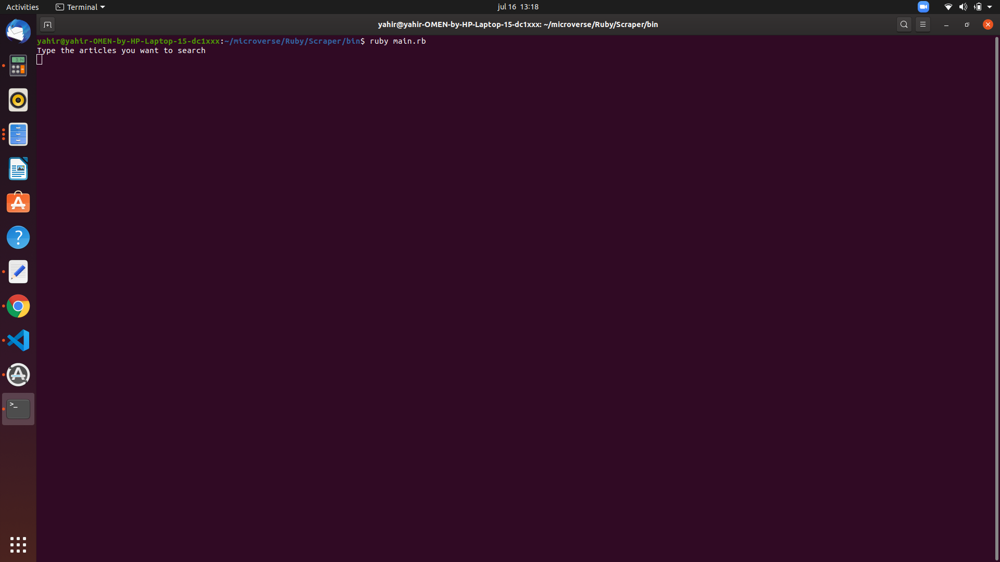
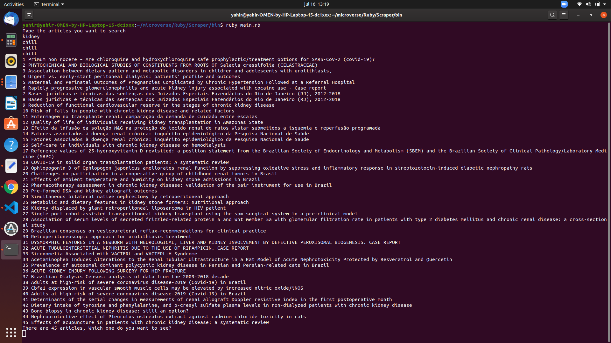
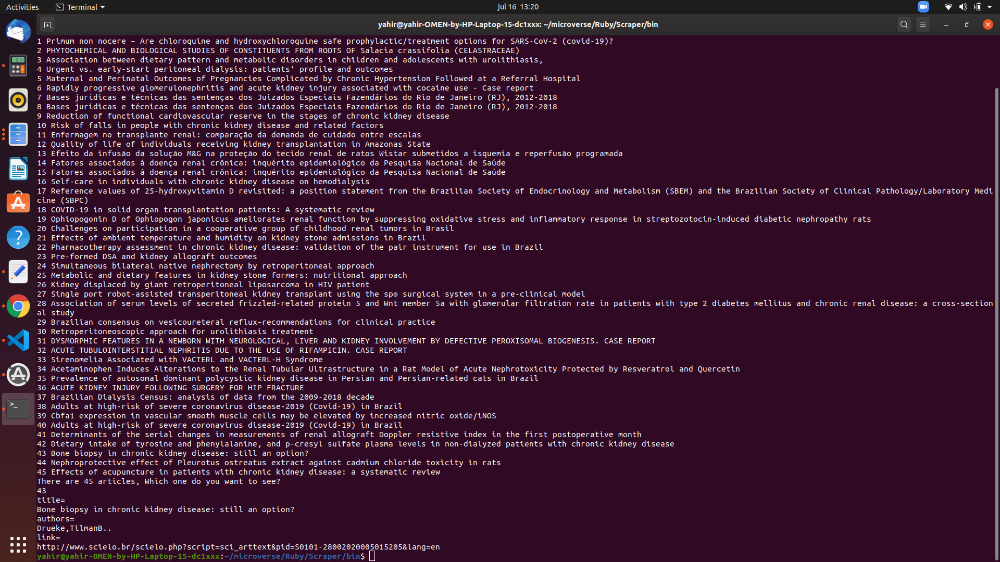

# Scraper

In this project, I build a Scraper that gets information of medical articles. It retrieves the title, the authors and the link of each article form the web page [Scielo](https://scielo.org/). You can choose from 45 articles which want you want to look.

## Built With

- Ruby
- Nokogiri
- Rubocop
- Byebug

## Getting Started

**To get a local copy and run the program follow the next instructions**

- Open your command line and type `git clone git@github.com:yahir91/Scraper.git`
- Go to the new repository, inside the command line type `cd scraper` to go to the repository folder.
- Run `bundle install` in the command line.
- To run the file enter `cd bin` to go to the bin folder, then type `ruby main.rb`.
- Type the articles that you want to search.
  
- Then select from a selection of 45 titles which articles information you want to see.
  
- You can see the article information and the link to go to that article.
  

## Run tests

- Tests have been created, to run them enter `rspec` in the command line inside the folder repository

## Author

👤 **Yahir Cardona**

- Github: [@yahir91](https://github.com/yahir91)
- Twitter: [@YahirCardona3](https://twitter.com/YahirCardona3)
- Linkedin: [linkedin](https://www.linkedin.com/in/osmar-yahir-cardona-reyes-54b40b1a7/)

## 🤝 Contributing

Contributions, issues and feature requests are welcome!

Feel free to check the [issues page](https://github.com/yahir91/Scraper/issues).

## Show your support

Give a ⭐️ if you like this project
